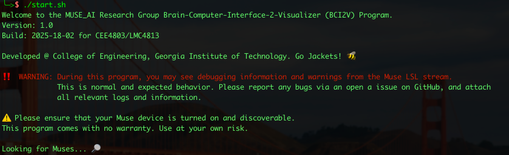
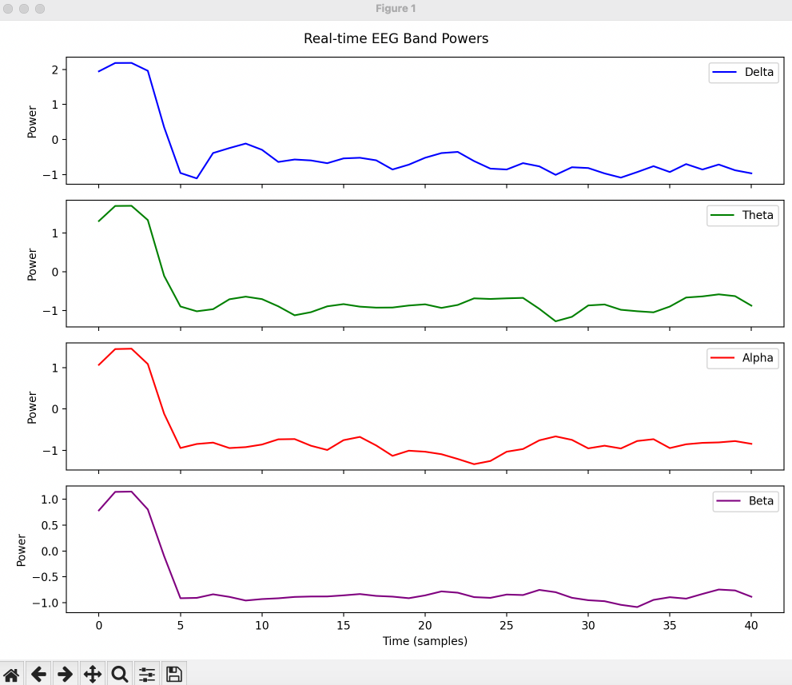
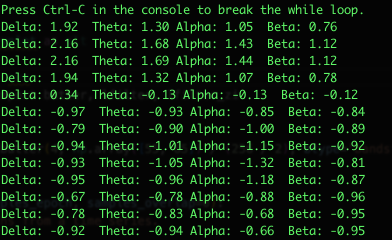
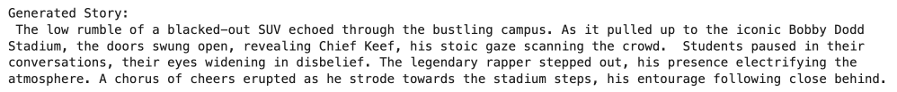
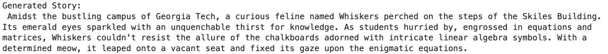
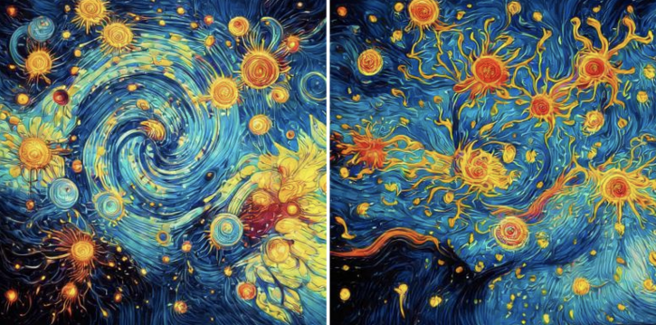

<div align="center">

# Art & Generative AI


#### Powered by:


#### Runs on:


#### About: 
This repository contains code for Georgia Tech's CEE4803/LMC4813 - Art & Generative AI course. 

It explores various applications of generative AI in the realms of art and creativity, including brainwave data retrieval and visualization, music generation, AI-powered storytelling, image generation, and video generation.


#### Author and TA: [Kenneth (Alex) Jenkins](https://alexj.io)

#### Professors: [Dr. Francesco Fedele](https://ce.gatech.edu/directory/person/francesco-fedele) and [Dr. Mark Leibert](https://lmc.gatech.edu/people/person/mark-leibert)

#### Special Thanks To: [Dennis Frank](https://www.linkedin.com/in/dennis-frank-cs/) #YouGotOut, Go Jackets! 🐝

</div>

---

> [!CAUTION]
> Code inside the `museDemo` folder is a work in progress.


## Table of Contents 📖

- [Foreword](#foreword)
- [Project Overview](#overview)
- [Installation](#installation)
- [Muse Demo](#muse-demo)
- [Usage](#usage)
- [FAQ](#faq)
- [License](#license)

---

## Foreword

🔮 **Advanced AI Models**
This project harnesses cutting-edge generative AI models like Meta's MusicGen, Google's Gemini Pro, Kokoro TTS, Deepseek's Janus-Pro, and ByteDance's AnimateDiff-Lightning **(all released 2024-2025)**. We've optimized these models for real-time creative generation—spanning music, text, images, and video—to run efficiently on a single [NVIDIA H100 GPU](https://www.nvidia.com/en-us/data-center/h100/).

⚡ **Power & Sustainability**
While these models represent significant efficiency improvements over their predecessors, power consumption remains a key consideration. A H100 GPU can consume up to 700 watts under load, highlighting the importance of optimization strategies like request batching, model quantization, and smart caching to reduce both energy usage and environmental impact.

> [!IMPORTANT]
> Please plan carefully when designing AI prompts to avoid unnecessary iterations and help reduce carbon emissions. [Think like the engineers of the 70s that used punch cards to run a computer and execute calculations.](https://en.wikipedia.org/wiki/Computer_programming_in_the_punched_card_era) They had only one shot, so they meticulously planned their work. Otherwise, they would have to wait months for another chance to use the computer. Every time you generate an image, write an story, or ask a chatbot a question, it has an environmental cost that cannot be immediately realized.

🔧 **Troubleshooting Guidelines**
For optimal performance, focus on three key areas: input/output validation (checking prompts and responses), resource monitoring (GPU and memory usage), and output quality control (through temperature and seed adjustment). Understanding model biases is essential for interpreting results accurately and ensuring reliable generation.

## Overview

1. Brainwave Data Retrieval + Brainwave Visualization 🧠

This code involves retrieving and processing brainwave data, from EEG devices (eg. MUSE/MUSE2), to analyze and visualize the brain’s activity. The system captures real-time brainwave signals from a range of -3 to 3, and generates visual representations that may be used for artistic expression or further analysis. Brainwave values are outputted directly to the terminal.

#### Screenshots:
- Program Start:



- Brainwave Data Visualization:



- Terminal Output:



____

2. Music Generation via AI 🎶

This Python notebook demonstrates how to generate music from text prompts using [Meta's MusicGen model](https://huggingface.co/facebook/musicgen-stereo-small), a state-of-the-art AI model for music generation. 

The notebook provides a step-by-step guide to installing the necessary packages, loading the pre-trained MusicGen model, and generating music based on user-provided text prompts. 

The model allows users to create 30-second audio clips by simply entering a descriptive prompt. This tool is ideal for exploring the intersection of AI and creative arts, offering a glimpse into the future of AI-driven music composition.

<div align="center" style="border: 2px solid #ccc; padding: 10px; display: inline-block; border-radius: 10px;">
  <a target="_blank" href="https://colab.research.google.com/drive/1ZZPfmNcl3226m3XnHCsBxpITFidkiKoe?usp=sharing">
    
  </a>
</div>

#### Example Outputs:

- **Prompt:** `Trance music while dancing through a Van Gogh painting`

<center>
  <video src="https://github.gatech.edu/Fedele-AI/Art_and_AI/assets/79958/85d29450-1d33-4c87-8eec-5127ef30ffc9"></video>
</center>

- **Prompt:** `Radiohead meets Pablo Picasso`

<center>
    <video src="https://github.gatech.edu/Fedele-AI/Art_and_AI/assets/79958/b8ab9703-26e8-46c3-a324-e94e5750ff8a"></video>
</center>

____

3. Storytelling AI Generation 🗿

Using [Google's Gemini Pro](https://gemini.google.com) model and [Kokoro TTS](https://huggingface.co/hexgrad/Kokoro-82M), this Python notebook generates AI-powered short stories based on user prompts, specifically tailored to the Georgia Tech campus environment. 

The system leverages natural language processing (NLP) and generative AI to create engaging narratives that incorporate campus culture, environment, and community. 

Users can input prompts to guide the story generation process, and the generated stories are then converted into audio using Kokoro TTS for an immersive experience. 

The code ensures that the stories are concise, have a clear beginning and end, and are free from internal thoughts or commentary. 

Users are also provided a slider to adjust the maximum length of the story, allowing for customization based on their preferences. This feature ensures flexibility in storytelling, whether users want a quick anecdote or a more detailed narrative.

> [!NOTE]
> Users must have a Google account to access the Gemini Pro model, please obtain an API key from [Google Cloud Platform](https://aistudio.google.com/app/apikey) and load it into the left sidebar of the notebook under the "Secrets" section as `GOOGLE_API_KEY`. If using the AI Makerspace, create a new file called `key.txt` and place your API-Key there in plain text. **No editing of the code is necessary**.

<div align="center" style="border: 2px solid #ccc; padding: 10px; display: inline-block; border-radius: 10px;">
  <a target="_blank" href="https://colab.research.google.com/drive/1a1UHi_9NbH9dAyTXe21-Z3PJ6q0dgcxD?usp=sharing">
    
  </a>
</div>

#### Example Outputs:
- Prompt: `Chief Keef pulls up to Georgia Tech`
  <center>
    <video src="https://github.gatech.edu/Fedele-AI/Art_and_AI/assets/79958/ddc2e2c6-19d1-4e8a-a55a-3dc41705d869"></video>

    

  </center>

- Prompt: `A Cat wants to take Linear Algebra`

  <center>
    <video src="https://github.gatech.edu/Fedele-AI/Art_and_AI/assets/79958/de6a0113-024c-4453-9047-7c5f4eff36cf"></video>
    <video src="./assets/audio/cat.mp3" controls="controls"   style="max-width: 730px;">
    </video>

    

  </center>

____

4. Image AI Generation 🏔️

This Python notebook uses [Deepseek's Janus-Pro model](https://huggingface.co/deepseek-ai/Janus-Pro-7B) to generate AI-powered images from text prompts, leveraging advanced generative AI and natural language processing. 

It installs necessary libraries, downloads the model, and allows users to customize image generation settings like temperature, parallel size, CFG weight, image tokens, image size, and patch size via interactive sliders. 

Users input a text prompt, and the model generates images based on the provided settings, which are then displayed in the notebook.

The code includes memory management to free resources after generation, ensuring efficient execution. This tool showcases the potential of AI in creating visual content from text, making it ideal for creative exploration and content creation.

<div align="center" style="border: 2px solid #ccc; padding: 10px; display: inline-block; border-radius: 10px;">
  <a target="_blank" href="https://colab.research.google.com/drive/1G68eXL3xScfx_a1tRsjvDDZH9ezAbzE5?usp=sharing">
    
  </a>
</div>

#### Example Outputs:

<center>

- Prompt: `A house that is bigger on the inside than the outside`

    

- Prompt: `Vangogh colours and neurons flying everywhere`

    

</center>

____

5. Video AI Generation 🎥

This code uses [ByteDance's AnimateDiff-Lightning model](https://huggingface.co/ByteDance/AnimateDiff-Lightning) to generate AI-powered videos from text prompts, leveraging advanced generative AI and natural language processing. 

It installs necessary libraries, downloads the model, and allows users to customize video generation settings like guidance scale, inference steps, and resolution via interactive sliders. 

Users input a text prompt, and the model generates an animated video, which is exported as a GIF and displayed in the notebook. The code includes memory management to free resources after generation, ensuring efficient execution. 

This tool showcases the potential of AI in creating dynamic visual content from text, making it ideal for storytelling and content creation.

<div align="center" style="border: 2px solid #ccc; padding: 10px; display: inline-block; border-radius: 10px;">
  <a target="_blank" href="https://colab.research.google.com/drive/14_3YPXYttHxF_shK5eAQDOQHm7yWlORB?usp=sharing">
    
  </a>
</div>

#### Example Outputs:

<center>

- Prompt: `Dancing under the moonlight with 100 horses`

    

- Prompt: `A naughty cat jumps on a table into a cup of coffee`

    

</center>

____

## Installation
> [!NOTE]
> This section is only required for users wanting to use the code inside the `museDemo` folder. All Juypter Notebooks are self contained, and include everything you need to get going in just a click of the first cell! 

> [!WARNING]
> These instructions are designed for users using python directly, (i.e. not in a virtual environment like `conda` or `venv`). If you are using a virtual environment, please ensure that you have the required dependencies installed in your environment by modifying the commands below.

- **Step 0.** Open a new Terminal/Powershell instance.

- **Step 1.** Clone the github repository.
```
git clone https://github.gatech.edu/Fedele-AI/Art_and_AI.git
```

- **Step 2.** Naviagate to the newly downloaded MUSE_Research_Group directory.
```
cd Art_and_AI/museDemo
```

- **Step 3.** Install the required dependencies. You may run the following command to install all required python dependencies:
```
python -m pip install -r requirements.txt
```

> [!TIP]
> If you're on a managed install, or recieve a warning about a python environment that is 'externally managed' - you'll need to run the following command at your own risk: `pip install -r requirements.txt --break-system-packages`. __**Note:**__ It is very unlikely that the command above will affect your system. However, it is not recommended to run this command in a production environment.

- **Step 4.** To run the program on **MacOS/Linux**, simply run the following command:
```
./start.sh
```

- On **Windows 10/11**, use the following command to start the program:
```
.\start.bat
```

> [!NOTE]
> Linux support is limited to Debian/Ubuntu based systems only. [See this issue](https://github.gatech.edu/Fedele-AI/Art_and_AI/issues/2).

## MUSE Demo
> [!NOTE]
> This section is only required for users wanting to use the code inside the `museDemo` folder. All Juypter Notebooks are self contained, and include everything you need to get going in just a click of the first cell! 

The museDemo folder contains a comprehensive software package for running brain-computer interface demonstrations using the Muse headset. This repository provides all necessary components to create an interactive experience where brainwave data from the Muse headset drives audio synthesis and processing.
System Requirements

#### Required Software:
- [SuperCollider (audio synthesis engine)](https://supercollider.github.io/)
- [Ableton Live (digital audio workstation)](https://www.ableton.com/en/trial/)

#### Required Files:
- SuperCollider script (`.scd` file) included in `museDemo/external_files`
- Ableton Live project (`.als` file) included in `museDemo/external_files`

#### Setup Instructions
- MIDI Configuration: 
  - For successful operation, your system must have a properly configured MIDI interface that bridges the brainwave data to the digital audio workstation.
  - This configuration is crucial and varies depending on your operating system:
    - You'll need to create a virtual MIDI bus device with 5 distinct input channels
    - Each input channel corresponds to one of the five brainwave measurements captured by the Muse headset:
      - Delta waves (deep sleep)
      - Theta waves (drowsiness/meditation)
      - Alpha waves (relaxed awareness)
      - Beta waves (active thinking)
      - Gamma waves (higher cognitive processing)

#### Configuration By Operating System:
MacOS:
- Use the "Audio MIDI Setup" utility to create a virtual MIDI bus. Configure the device to handle 5 distinct input channels.

Windows:
- Install a virtual MIDI bus utility such as [loopMIDI](https://www.tobias-erichsen.de/software/loopmidi.html). Create 5 separate ports or ensure your virtual MIDI device can handle 5 discrete channels.

Linux:
- Use ALSA or JACK MIDI routing capabilities. Configure 5 separate MIDI connections through these systems.

#### Running the Demo:
1. Power on and connect your Muse headset
2. Open the SuperCollider script (`.scd` file)
  - Some tips:
    - Use SHIFT + ENTER to run line by line as desired
    - CTRL + . to stop running the song (and then you may have to also run the allNotesOff commands at the top, too, to make the digital audio workstation stop making noise)
    - If SuperCollider is receiving data from the Muse, you will see it populate (fast) after running `OSCFunc.trace(true)`. You can then run `OSCFunc.trace(false)` to stop the data stream from going (improves performance) although data is still being recieved in the background.
    - The easiest variable to play with will be `base_tempo` which will change the speed of the song
3. Open the Ableton Live project (`.als` file)
4. Verify MIDI connections are properly established (update **MIDI From** to be each MIDI bus)
5. Execute the main block of the SuperCollider script
  - Double click at the beginning of a block to select the whole block before running it (block will be highlighted in *dark* gray)
6. Begin the demonstration - brainwave data should now drive the audio processing, thus creating music.

## Usage
The course has been approved to utilize Georgia Tech's newly opened [AI Makerspace](https://coe.gatech.edu/academics/ai-for-engineering/ai-makerspace), a super-computing hub designed to provide students with access to advanced AI computing resources. 

This facility, established in collaboration with NVIDIA, offers a virtual gateway to a high-performance computing environment, enhancing hands-on learning experiences in AI. This code has been optimized to run on the NVIDIA H100 GPU using CUDA.

<p align="center">
  
</p>

To run the provided code, you can upload it through the PACE Open OnDemand web interface. [Access the web interface here](https://vpn.gatech.edu/https/ondemand-ice.pace.gatech.edu/) (GT VPN required). This platform allows you to manage files and execute applications within a user-friendly browser environment.

For detailed instructions on accessing and using the AI Makerspace resources, please refer to the [Getting Started with ICE guide](https://gatech.service-now.com/home?id=kb_article_view&sysparm_article=KB0042102).

> [!NOTE]
> If you choose to run the code on the AI Makerspace, please ignore the comment about the `T4 GPU`, as this is only required on Google Colab.

Please ensure you have the necessary [VPN access](https://vpn.gatech.edu/) before attempting to utilize GT provided resources.

## FAQ

**Q: Why does this course use CUDA and NVIDIA GPUs?** or **If these are the latest and greatest models, why don’t they look/sound like it?**
- **A:** [NVIDIA GPUs, particularly the H-series](https://www.cnbc.com/amp/2023/10/17/us-bans-export-of-more-ai-chips-including-nvidia-h800-to-china.html), are industry leaders in AI acceleration due to their unparalleled performance and efficiency. Today, CUDA serves as the dominant framework for machine learning workflows. It’s important to remember that these enterprise grade GPUs are expensive to run, and we must conserve power when possible — [a single H100 can pull 700 watts at full load](https://www.tomshardware.com/tech-industry/nvidias-h100-gpus-will-consume-more-power-than-some-countries-each-gpu-consumes-700w-of-power-35-million-are-expected-to-be-sold-in-the-coming-year)! That’s as much as a small microwave running continuously. While NVIDIA’s contributions to the AI-Makerspace are substantial, our course emphasizes responsible usage through optimization techniques to reduce energy consumption whenever possible. Moreover, thanks to these optimizations, all code can be executed simultaneously on a single H100!

---

**Q: Are the AI models used in this course the latest available?**  
- **A:** The models (e.g., MusicGen, Janus Pro, etc) are ALL state-of-the-art but intentionally optimized for efficiency. They are smaller in size compared to larger counterparts, reducing computational demands and environmental impact. This approach ensures students can experiment without excessive resource consumption, aligning with our goal of sustainability with education.  

---

**Q: How do I obtain an API key for Google’s Gemini Pro?**  
- **A:** Follow the steps in the "Storytelling AI Generation" section:  
1. Visit [Google Cloud Platform](https://aistudio.google.com/app/apikey).  
2. Create an API key under your Google account.  
3. Add it to the notebook’s "Secrets" section as `GOOGLE_API_KEY`.

> [!TIP]
> You may also run the script via the use of an `key.txt` file relative to the `text2story.ipynb` notebook. Just paste your key in there in plain text, no modification of the notebook's code is required.

---

**Q: What if I encounter GPU memory errors?**  
- **A:** Reduce batch sizes, lower resolution settings, or close background applications. For AI Makerspace users, [ensure jobs are submitted with adequate resources via PACE](https://gatech.service-now.com/home?id=kb_article_view&sysparm_article=KB0042095).  

--- 

**Q: Is brainwave data collection hardware required to use this repository?**  
- **A:** No — an EEG headset is only required if you want to use the code inside the `museDemo` folder. All Jupyter notebooks are self contained, and can run on both Colab and the AI-Makerspace without modification.

--- 
> [!TIP]
> **Still have questions?**  
> Please [contact OIT for GT resource issues](https://oit.gatech.edu/) or refer to the project’s [GitHub Issues](https://github.gatech.edu/Fedele-AI/Art_and_AI/issues) for bugs with code. For other issues, please email your TA or instructor - or use Piazza.


## License

> [!WARNING]
> **This repository is licensed under the [GNU General Public License V3](https://www.gnu.org/licenses/gpl-3.0.txt), per our license - you must agree to the statement below**:
> 
> THERE IS NO WARRANTY FOR ANY OF THESE PROGRAMS, TO THE EXTENT PERMITTED BY
APPLICABLE LAW.  EXCEPT WHEN OTHERWISE STATED IN WRITING THE COPYRIGHT
HOLDERS AND/OR OTHER PARTIES PROVIDE THE PROGRAM "AS IS" WITHOUT WARRANTY
OF ANY KIND, EITHER EXPRESSED OR IMPLIED, INCLUDING, BUT NOT LIMITED TO,
THE IMPLIED WARRANTIES OF MERCHANTABILITY AND FITNESS FOR A PARTICULAR
PURPOSE.  THE ENTIRE RISK AS TO THE QUALITY AND PERFORMANCE OF THE PROGRAM
IS WITH YOU.  SHOULD THE PROGRAM PROVE DEFECTIVE, YOU ASSUME THE COST OF
ALL NECESSARY SERVICING, REPAIR OR CORRECTION.
>
> Additionally, **before using any Institute provided resources - you must agree to the statement below**:
>
> Any user of this service must comply with all Institute and Board of Regents policies, including the [Acceptable Use Policy, Cyber Security Policy and Data Privacy Policy](http://b.gatech.edu/it-policies). While Georgia Tech upholds a commitment to respecting the privacy expectations of all employees and students, please be aware that any electronic information transmitted over or stored in Georgia Tech systems and networks is subject to audit, inspection, and disclosure to fulfill administrative or legal obligations. It is important to note that any personal communications and files transmitted over or stored on Georgia Tech systems are also subject to the same regulations as business communications.

**_TL;DR_** Here's what the GPLv3 entails:
```markdown
1. Anyone can copy, modify and distribute this software.
2. You have to include the license and copyright notice with each and every distribution.
3. You can use this software privately.
4. You can use this software for commercial purposes.
5. If you dare build your business solely from this code, you risk open-sourcing the whole code base.
6. If you modify it, you have to indicate changes made to the code.
7. Any modifications of this code base MUST be distributed with the same license, GPLv3.
8. This software is provided without warranty.
9. The software author or license can not be held liable for any damages inflicted by the software.
10. This software is provided to you free of charge, if you paid money for this software - request a refund immediately.
```
> [!NOTE]
> If you're wanting to contribute to this repository, [you'll need to read and accept our contributor code of conduct](https://github.gatech.edu/Fedele-AI/Art_and_AI/tree/main?tab=coc-ov-file#readme). Fedele_AI is committed to creating a welcoming and collaborative environment for everyone, and your participation is a crucial part of that!
